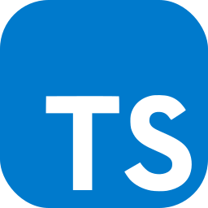
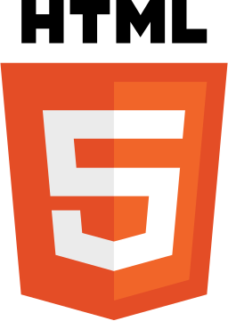
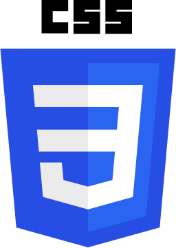
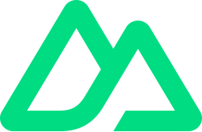
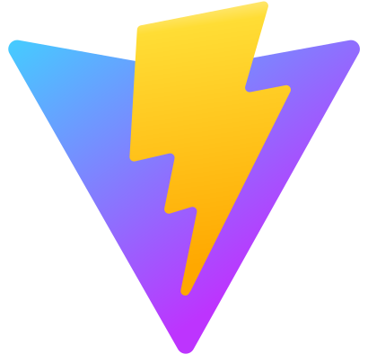
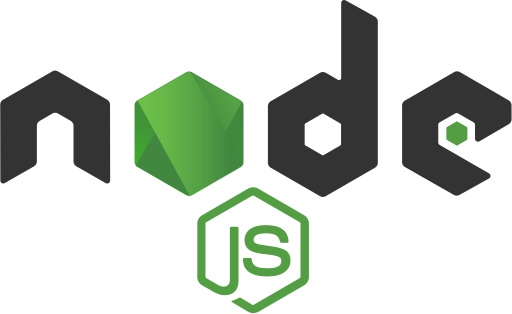
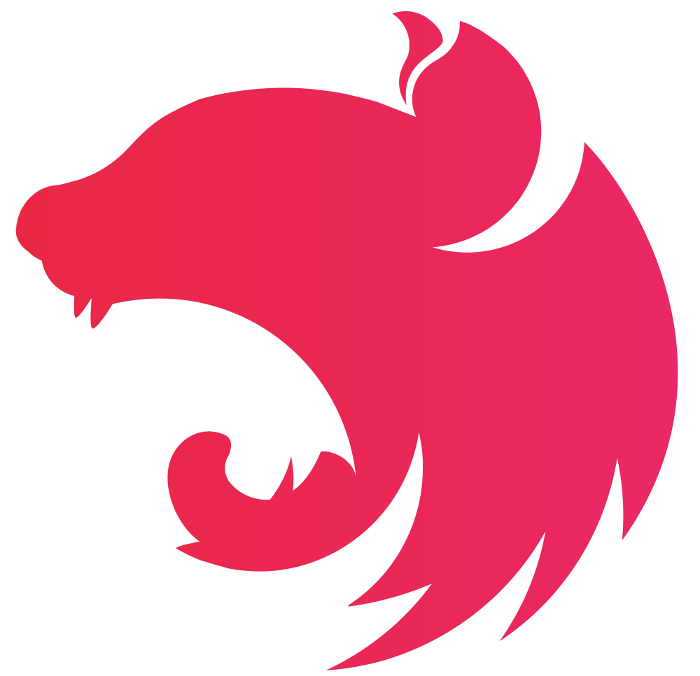

# 👋 Hey, I'm Joy

🚀 Fullstack Developer | 🏗 Frontend Architect

🌐 https://zhengjynicolas.github.io/

---

## ⚡ Tech Stack

---

## 📊 GitHub Activity

---

## 🧠 Focus

* ⚡ Performance Optimization
* ♿ Accessibility (A11Y)
* 🔍 SEO & Web Experience
* 🏗 Scalable Frontend Architecture

---

## 🏢 Experience

---

## 🌍 Languages

* 🇨🇳 Mandarin — Native
* 🇯🇵 Japanese — Fluent
* 🇺🇸 English — Fluent

---
