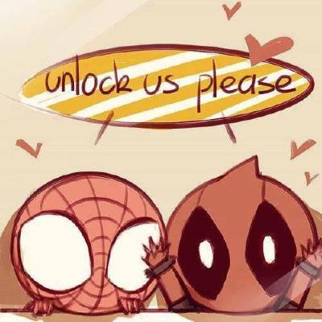
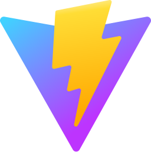
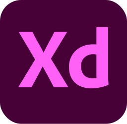

# Hi there 👋 welcome to my 🏠 I am Joy 

## My Skills & Tools

## Served Company

<!--
**zhengjynicolas/zhengjynicolas** is a ✨ _special_ ✨ repository because its `README.md` (this file) appears on your GitHub profile.

Here are some ideas to get you started:

- 🔭 I’m currently working on ...
- 🌱 I’m currently learning ...
- 👯 I’m looking to collaborate on ...
- 🤔 I’m looking for help with ...
- 💬 Ask me about ...
- 📫 How to reach me: ...
- 😄 Pronouns: ...
- ⚡ Fun fact: ...
-->

[//]: # (https://github.com/anuraghazra/github-readme-stats)
[//]: # (![Joy's GitHub stats]&#40;https://github-readme-stats.vercel.app/api?username=zhengjynicolas&show=reviews,discussions_started,discussions_answered,prs_merged,prs_merged_percentage&show_icons=true&theme=ambient_gradient&#41;)